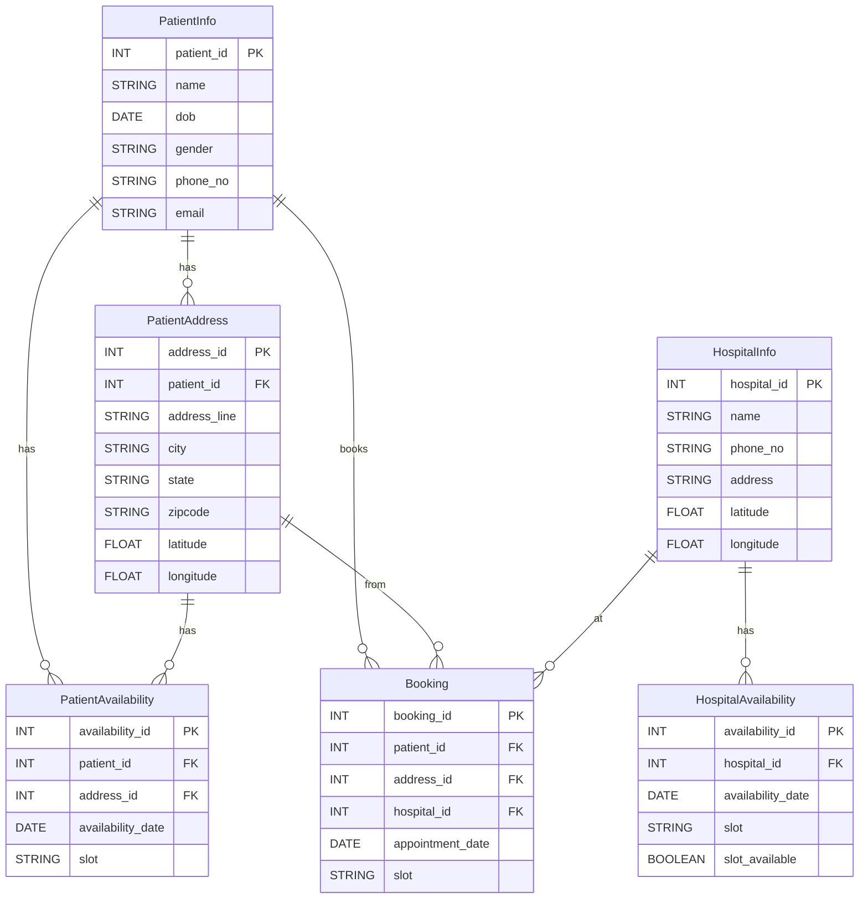
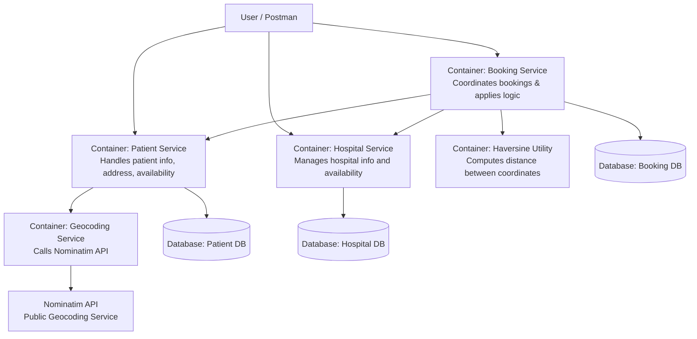

# HospitalBooking


## 1.eerd diagram




## 🏥 C2 Architecture - Container View



## 🏥 C4 Architecture – Container View (Simplified)

```mermaid
graph TD
  user[User]
  subgraph "Hospital Appointment Booking System"
    patientSvc[Patient Service<br/>Manages patient info, address, availability]
    hospitalSvc[Hospital Service<br/>Handles hospital info and slot availability]
    bookingSvc[Booking Service<br/>Orchestrates appointments based on logic]
    geocodeSvc[Geocoding Service<br/>Uses Nominatim API to convert address to coordinates]
    haversine[Haversine Utility<br/>Calculates distance between coordinates]

    patientDB[(Patient DB)]
    hospitalDB[(Hospital DB)]
    bookingDB[(Booking DB)]
  end

  nominatim[Nominatim API<br/>External Geocoding Service]

  user --> bookingSvc
  user --> patientSvc
  user --> hospitalSvc

  patientSvc --> geocodeSvc
  geocodeSvc --> nominatim

  bookingSvc --> patientSvc
  bookingSvc --> hospitalSvc
  bookingSvc --> haversine

  patientSvc --> patientDB
  hospitalSvc --> hospitalDB
  bookingSvc --> bookingDB


